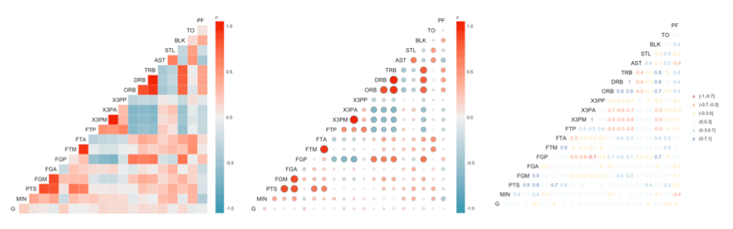

# ggcorr: correlation matrixes with ggplot2



This repository contains the latest version of the `ggcorr` function, which allows to plot correlation matrixes with [`ggplot2`](http://ggplot2.org/).

## INSTALL

`ggcorr` is part of the __`GGally`__ package. Install it [from CRAN](https://cran.r-project.org/web/packages/GGally/):

```{r}
install.packages("GGally")
```

You can also use `ggcorr` as a standalone function from this repository:

```{r}
source("https://raw.githubusercontent.com/briatte/ggcorr/master/ggcorr.R")
```

## VIGNETTE

The `ggcorr` function is fully documented in [this vignette](https://briatte.github.io/ggcorr/).

The [vignette source](vignette) is included in this repository.

## THANKS

- The idea for this function comes from [a Stack Overflow question](http://stackoverflow.com/questions/12196756/significance-level-added-to-matrix-correlation-heatmap-using-ggplot2).
- The examples shown above use NBA statistics shared [by Nathan Yau](http://flowingdata.com/2010/01/21/how-to-make-a-heatmap-a-quick-and-easy-solution/).
- [Barret Schloerke](https://github.com/schloerke) helps by maintaining the `GGally` package
