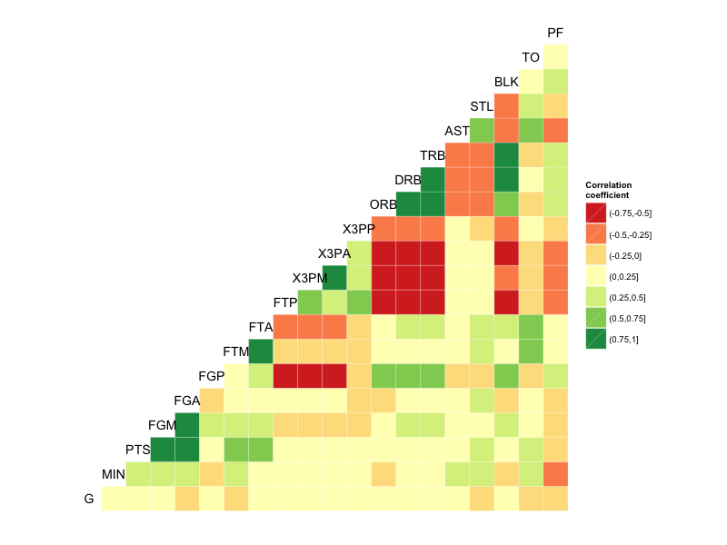
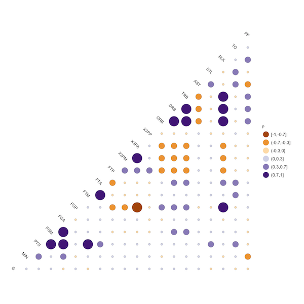

# ggcorr: correlation matrixes with ggplot2

This function is part of the [GGally][ggally] package. Install it from CRAN or from GitHub:

	# Github
	library(devtools)
	install_github("ggobi/ggally")

	# CRAN
	install.packages("GGally")

[Someone at Stack Overflow][so] suggested plotting correlation matrixes with `ggplot2`. 
`ggcorr` implements that idea in a style similar to the `corrplot` function of the `arm` package. 
The examples below uses [NBA statistics][fd] shared by Nathan Yau at Flowing Data.

[ggally]: https://github.com/ggobi/ggally
[so]: http://stackoverflow.com/questions/12196756/significance-level-added-to-matrix-correlation-heatmap-using-ggplot2
[fd]: http://flowingdata.com/2010/01/21/how-to-make-a-heatmap-a-quick-and-easy-solution/
